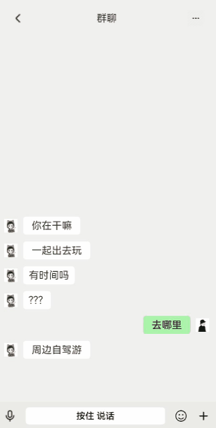

# 语音录制和声音动效实现

### 介绍

本示例使用AVrecord录制音频和AVrecord的getAudioCapturerMaxAmplitude接口获取振幅实现UI动效;使用AVplayer播放音频

### 效果图预览



**使用说明**

1. 按住按钮开始录音。
2. 释放发送语音消息。
3. 拖拽到“文”字进行语音转文字模拟。
4. 拖拽到“取消”则放弃发送。
5. 录制完成后点击语音消息框可播放录音。


### 实现思路

1. 利用组合手势来实现音频录制与取消录制。
```typescript
build() {
  Column() {
    Button($r('app.string.voice_record_dynamic_effect_button')) 
      .gesture(
        GestureGroup(GestureMode.Sequence,
          LongPressGesture()
            .onAction( () => {
              this.AVrecord.startRecordingProcess();
            })
            .onActionEnd( () => {
              this.AVrecord.stopRecordingProcess();
            }),
          PanGesture()
            .onActionStart( () => {
              clearInterval(this.count);
            })
            .onActionEnd( () => {
              this.AVrecord.stopRecordingProcess();
            })
        )
          .onCancel( () => {
            this.AVrecord.startRecordingProcess();
          })
      )
    }
}

```
2. 在音频录制的时候通过getAudioCapturerMaxAmplitude获取声音振幅使UI变化。
   (1)在录制音频的时候通过getAudioCapturerMaxAmplitude获取振幅；
   (2)对振幅做占比运算，随机取最大值与最小值之间的值（Math.floor(Math.random()）来使column的高度随机变化；
```typescript
async
startRecordingProcess()
{
  if (this.avRecorder !== undefined) {
    await this.avRecorder.release();
    this.avRecorder = undefined;
  }
  // 1.创建录制实例
  this.avRecorder = await media.createAVRecorder();
  this.setAudioRecorderCallback();
  // 2.获取录制文件fd赋予avConfig里的url；参考FilePicker文档
  const context = getContext(this);
  const path = context.filesDir;
  const filepath = path + '01.mp3';
  const file = fs.openSync(filepath, fs.OpenMode.READ_WRITE | fs.OpenMode.CREATE);
  const fdNumber = file.fd;
  this.avConfig.url = 'fd://' + fdNumber;
  // 3.配置录制参数完成准备工作
  await this.avRecorder.prepare(this.avConfig);
  // 4.开始录制
  await this.avRecorder.start();
  // 获取最大振幅
  this.time = setInterval(() => {
    this.avRecorder!.getAudioCapturerMaxAmplitude((_: BusinessError, amplitude: number) => {
      this.maxAmplitude = amplitude;
    });
  }, Const.COLUMN_HEIGHT);
}

Row() {
   Image($r("app.media.voice_record_dynamic_effect_icon"))
      .width($r("app.integer.voice_record_dynamic_effect_width_image"))
      .height($r("app.integer.voice_record_dynamic_effect_height_image"))
   Button($r("app.string.voice_record_dynamic_effect_button"))
      .type(ButtonType.Normal)
      .borderRadius(5)
      .backgroundColor(Color.White)
      .width($r("app.integer.voice_record_dynamic_effect_width_button"))
      .height($r("app.integer.voice_record_dynamic_effect_height_button"))
      .fontColor(Color.Black)
      .gesture(
         GestureGroup(GestureMode.Sequence,
            LongPressGesture()
               .onAction(() => {
                  this.mode = 0;
                  // 获取时间戳
                  this.timeStart = Math.floor(new Date().getTime() / Const.ANIMATION_DURATION);
                  this.flagInfoOpacity = Const.OPACITY_FALSE;
                  this.isListening = !this.isListening;
                  this.flagUpOpacity = Const.OPACITY_TRUE;
                  this.AVrecord.startRecordingProcess();
                  // 每隔100ms获取一次振幅
                  this.count = setInterval(() => {
                     if (this.AVrecord.maxAmplitude > Const.MIN_AMPLITUDE) {
                        this.maxNumber = (this.AVrecord.maxAmplitude) / Const.MAX_AMPLITUDE * Const.COLUMN_HEIGHT;
                        this.maxNumber = this.maxNumber >= 60 ? 60 : this.maxNumber;
                        this.minNumber = this.maxNumber - Const.HEIGHT_MIN;
                     } else {
                        this.maxNumber = Const.OPACITY_FALSE;
                        this.minNumber = Const.OPACITY_FALSE;
                     }
                     if (this.isListening) {
                        animateTo({ duration: Const.ANIMATION_DURATION, curve: Curve.EaseInOut }, () => {
                           this.yMax = Math.round(Math.random()*60);
                           this.yMin = Math.round(Math.random()*20);
                        })
                     }
                  }, Const.SET_INTERVAL_TIME);
               })
               .onActionEnd(() => {
                  clearInterval(this.count);
                  this.flagInfoOpacity = Const.OPACITY_TRUE;
                  this.yMax = Const.OPACITY_FALSE;
                  this.yMin = Const.OPACITY_FALSE;
                  this.AVrecord.stopRecordingProcess();
               }),
            // 上划左边取消，右边转文字
            PanGesture({ direction: PanDirection.Left | PanDirection.Right | PanDirection.Up, distance: 50 })
               .onActionStart((event: GestureEvent) => {
                  let offsetX = event.offsetX;
                  let offsetY = event.offsetY;
                  //0=语音录制，1=转文字，2=取消
                  this.mode = getMode(offsetX, offsetY);
                  this.updateStateByMode();
               })
               .onActionUpdate((event: GestureEvent) => {
                  let offsetX = event.offsetX;
                  let offsetY = event.offsetY;
                  //0=语音录制，1=转文字，2=取消
                  this.mode = getMode(offsetX, offsetY);
                  this.updateStateByMode();
               })
               .onActionEnd(() => {
                  this.resetState();
                  //发送语音，计算时间
                  if(this.mode == 0){
                     this.timeEnd = Math.floor(new Date().getTime() / Const.ANIMATION_DURATION);
                     this.timeAv = this.timeEnd - this.timeStart;
                  }
                  clearInterval(this.count);
                  this.isListening = false;
                  animateTo({ duration: Const.OPACITY_FALSE }, () => {
                     this.yMax = Const.OPACITY_FALSE;
                     this.yMin = Const.OPACITY_FALSE;
                  })
                  this.flagUpOpacity = Const.OPACITY_FALSE;
                  if(this.mode == 0){
                     this.flagInfoOpacity = Const.OPACITY_TRUE;
                  }
                  this.AVrecord.stopRecordingProcess();
               })
         )
            .onCancel(() => {
               //重置状态
               this.resetState();
               // 获取结束时间戳并计算出手势持续时间
               this.timeEnd = Math.floor(new Date().getTime() / Const.ANIMATION_DURATION);
               this.timeAv = this.timeEnd - this.timeStart;
               clearInterval(this.count);
               this.isListening = false;
               // TODO：知识点：当不需要动画时设置duration为0打断动画。
               animateTo({ duration: Const.OPACITY_FALSE }, () => {
                  this.yMax = Const.OPACITY_FALSE;
                  this.yMin = Const.OPACITY_FALSE;
               });
               this.flagUpOpacity = Const.OPACITY_FALSE;
               if(this.mode == 0){
                  this.flagInfoOpacity = Const.OPACITY_TRUE;
               }
               this.AVrecord.stopRecordingProcess();
            })
      )
   Image($r("app.media.voice_record_dynamic_effect_emoji")).width($r("app.integer.voice_record_dynamic_effect_width_image")).height($r("app.integer.voice_record_dynamic_effect_height_image"))
   Image($r("app.media.voice_record_dynamic_effect_add")).width($r("app.integer.voice_record_dynamic_effect_width_image")).height($r("app.integer.voice_record_dynamic_effect_height_image"))
}
.justifyContent(FlexAlign.SpaceAround)
   .width($r('app.string.voice_record_dynamic_effect_width_full'))
   .height($r("app.integer.voice_record_dynamic_effect_height_row"))
   .backgroundColor($r("app.color.voice_record_dynamic_effect_color_row"))
  ...
}
```
3. 使用AVplayer播放已录制的音频。
```typescript
Image($r('app.media.voice_record_dynamic_effect_icon'))
  .width($r('app.integer.voice_record_dynamic_effect_width_image'))
  .height($r('app.integer.voice_record_dynamic_effect_height_image'))
  .onClick( () => {
    this.AVplaer.avPlayerUrlDemo();
  } )

```
### 工程结构&模块类型

```
normalcaptu                                      // har类型
|---src
|   |---main
|   |     |---ets
|   |     |  |---common                        
|   |        |    |---CommonConstants.ets       // 常量定义 
|   |     |  |---pages                          
|   |        |    |---Index.ets                 // 主页面
```

### 模块依赖

路由模块[注册路由](../routermodule/src/main/ets/router/DynamicsRouter.ets)。

### 参考资料

[组合手势](https://developer.huawei.com/consumer/cn/doc/harmonyos-references/ts-combined-gestures-0000001774280894)

[音频录制](https://developer.huawei.com/consumer/cn/doc/harmonyos-guides-V2/avplayer-avrecorder-overview-0000001454485268-V2)

[动画](https://developer.huawei.com/consumer/cn/doc/harmonyos-references/ts-explicit-animation-0000001774121350)

